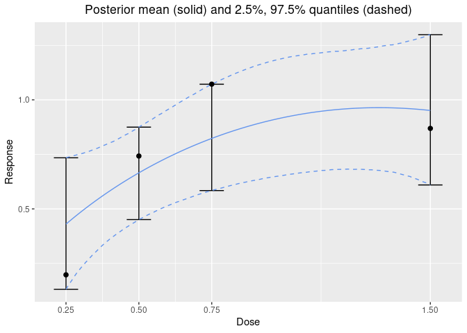
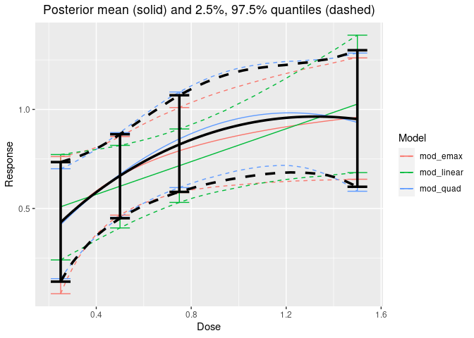

<!-- README.md is generated from README.Rmd. Please edit that file -->

# dreamer 

The goal of dreamer (Dose REsponse bAyesian Model avERaging) is to
flexibly model (longitudinal) dose-response relationships. This is
accomplished using Bayesian model averaging of parametric dose-response
models.

# Installation

The R package dreamer can be installed directly from github:
`devtools::install_github("rich-payne/dreamer")`.

For feature requests and to report bugs, you can visit the [dreamer
github](https://github.com/rich-payne/dreamer/issues).

# Bayesian Model Averaging

Bayesian model averaging is a general mixture distribution, where each
mixture component is a different parametric model. Prior weights are
placed on each model and the posterior model weights are updated based
on how well each model fits the data. Let *μ*(*d*) represent the mean of
the dose response curve at dose *d*,
*y* = {*y*<sub>1</sub>, …, *y*<sub>*n*</sub>} be the observed data, and
*m* ∈ {1, …, *M*} be an index on the *M* parametric models. Then the
posterior of the dose response curve, *μ*(*d*), of the Bayesian model
averaging model is

where *p*(*μ*(*d*) ∣ *y*, *m*) is the posterior mean dose response curve
from model *m*, *p*(*m* ∣ *y*) is the posterior weight of model *m*,
*p*(*y* ∣ *m*) is the marginal likelihood of the data under model *m*,
and *p*(*m*) is the prior weight assigned to model *m*. In cases where
*p*(*y* ∣ *m*) is difficult to compute, Gould (2019) proposed using the
observed data’s fit to the posterior predictive distribution as a
surrogate in calculating the posterior weights; this is the approach
used by dreamer.

dreamer supports a number of models including linear, quadratic,
log-linear, log-quadratic, EMAX, exponential, for use as models that can
be included in the model averaging approach. In addition, several
longitudinal models are also suppored (see the vignette). All of the
above models are available for both continuous and binary endpoints.

## Example

With dreamer, it is easy to generate data, fit models, and visualize
model fits. See the vignette for a more comprehensive overview.

``` r
library(dreamer)
# GENERATE DATA FROM A QUADRATIC DOSE RESPONSE
set.seed(888)
data <- dreamer_data_quad(
  n_cohorts = c(10, 10, 10, 10), # number of subjects in each cohort
  dose = c(.25, .5, .75, 1.5), # dose administered to each cohort
  b1 = 0,
  b2 = 2,
  b3 = -1,
  sigma = .5 # standard deviation
)

# BAYESIAN MODEL AVERAGING
output <- dreamer_mcmc(
  data = data,
  # mcmc information
  n_adapt = 1e3,
  n_burn = 1e3,
  n_iter = 1e4,
  n_chains = 2,
  silent = TRUE, # make rjags be quiet
  # model definitions
  mod_linear = model_linear(
    mu_b1 = 0,
    sigma_b1 = 1,
    mu_b2 = 0,
    sigma_b2 = 1,
    shape = 1,
    rate = .001,
    w_prior = 1 / 3 # prior probability of the model
  ),
  mod_quad = model_quad(
    mu_b1 = 0,
    sigma_b1 = 1,
    mu_b2 = 0,
    sigma_b2 = 1,
    mu_b3 = 0,
    sigma_b3 = 1,
    shape = 1,
    rate = .001,
    w_prior = 1 / 3
  ),
  mod_emax = model_emax(
    mu_b1 = 0,
    sigma_b1 = 1,
    mu_b2 = 0,
    sigma_b2 = 1,
    mu_b3 = 0,
    sigma_b3 = 1,
    mu_b4 = 0,
    sigma_b4 = 1,
    shape = 1,
    rate = .001,
    w_prior = 1 / 3
  )
)

# plot Bayesian model averaging fit
plot(output, data = data)
```



``` r
# plot individual fits
plot_comparison(output)
```



``` r
# posterior summary
summary(output)
#> $model_weights
#> # A tibble: 3 x 3
#>   model      posterior_weight prior_weight
#>   <chr>      <chr>            <chr>       
#> 1 mod_quad   65.1%            33.3%       
#> 2 mod_emax   24.4%            33.3%       
#> 3 mod_linear 10.5%            33.3%       
#> 
#> $summary
#> # A tibble: 12 x 14
#>    model param    mean     sd      se   se_ts  `2.5%`   `25%`   `50%`  `75%`
#>    <chr> <chr>   <dbl>  <dbl>   <dbl>   <dbl>   <dbl>   <dbl>   <dbl>  <dbl>
#>  1 mod_… b1     0.405  0.174  1.23e-3 1.23e-3  0.0599  0.291   0.405   0.521
#>  2 mod_… b2     0.415  0.196  1.39e-3 1.39e-3  0.0309  0.283   0.415   0.544
#>  3 mod_… sigma  0.600  0.0690 4.88e-4 5.06e-4  0.484   0.551   0.594   0.643
#>  4 mod_… b1     0.0894 0.258  1.83e-3 1.94e-3 -0.408  -0.0847  0.0866  0.260
#>  5 mod_… b2     1.47   0.679  4.80e-3 5.20e-3  0.125   1.01    1.48    1.93 
#>  6 mod_… b3    -0.603  0.373  2.64e-3 2.84e-3 -1.33   -0.856  -0.606  -0.353
#>  7 mod_… sigma  0.568  0.0687 4.86e-4 5.56e-4  0.453   0.520   0.561   0.609
#>  8 mod_… b1    -0.192  0.567  4.01e-3 1.08e-2 -1.48   -0.516  -0.125   0.196
#>  9 mod_… b2     1.35   0.438  3.10e-3 6.47e-3  0.694   1.06    1.27    1.57 
#> 10 mod_… b3    -0.691  0.830  5.87e-3 2.18e-2 -2.08   -1.27   -0.796  -0.194
#> 11 mod_… b4     1.13   0.625  4.42e-3 1.19e-2  0.171   0.666   1.04    1.51 
#> 12 mod_… sigma  0.575  0.0678 4.79e-4 6.65e-4  0.460   0.527   0.569   0.615
#> # … with 4 more variables: `97.5%` <dbl>, gelman_point <dbl>,
#> #   gelman_upper <dbl>, effective_size <dbl>
```

## Reference

Gould, A. Lawrence. “BMA‐Mod: A Bayesian model averaging strategy for
determining dose‐response relationships in the presence of model
uncertainty.” *Biometrical Journal* 61.5 (2019): 1141-1159.
